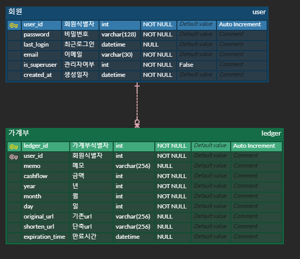
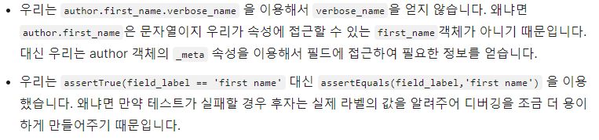
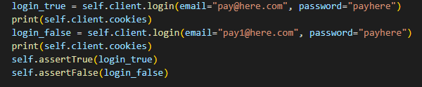
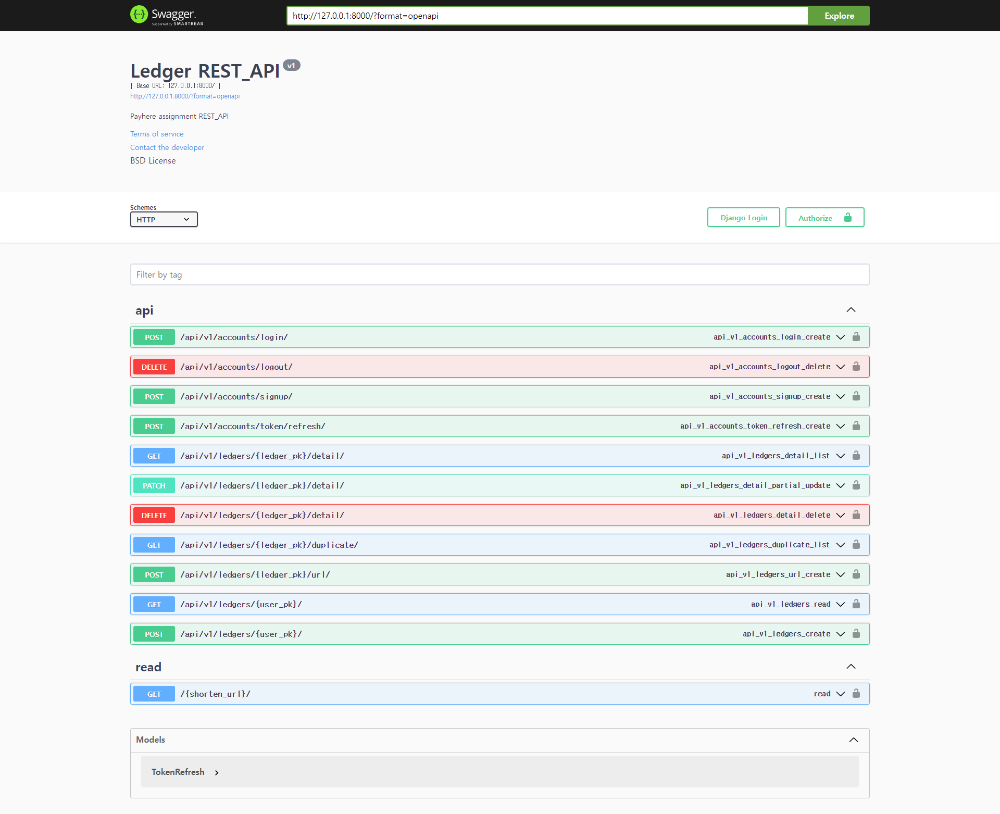

## :book: 가계부

### 0. 환경

- 언어 : Python 3.9
- DB : MySQL 5.7
- framework: Django 3.2.12

 

### 1. 설계

> ERD

 

### 2. accounts

- [모델링 참고](https://iamthejiheee.tistory.com/78)

- [serializer의 create](https://www.django-rest-framework.org/tutorial/1-serialization/)

 

### 3. ledger

> [3-f. 가계부의 세부 내역을 복제할 수 있습니다.](https://docs.djangoproject.com/en/3.2/topics/db/queries/#copying-model-instances)

> [3-g. 가계부의 특정 세부 내역을 공유할 수 있게 단축 URL을 만들 수 있습니다](https://ninano1109.tistory.com/63)
>
> 블로그 보면서 비슷하게 구현함
>
> 사실 문제 자체를 정확히 이해하지 못했는데, 
> front 쪽에서의 가계부 세부 내역 url을 보내면 단축 url을 return해주는 것이라고 이해하고 함수를 만들었다.
>
> 여기서 문제가 될만한 것은
>
> 1. 여러 요청들에 대해서 url이 겹치지 않게 할 수 있는지 잘 모르겠다는 것 => 일단 sha256(기존url+현재시간)[:8]로 함
> 2. 가계부이기 때문에 원래는 세부 내역 조회에 대해서도 본인만 볼 수 있게 조건문을 걸어뒀었는데, 그러면 단축 url을 줬을 때 다른 사람이 못보니까 풀었다.
> 3. 단축 url 길이 기준

 

### 4. [TestCase](https://developer.mozilla.org/ko/docs/Learn/Server-side/Django/Testing)

1. ledger model test에서 user를 생성해놨는데 접근이 안되는 이유를 모르겠다.

2. CASCADE 테스트 코드 어떻게 만들지 고민하고 있었는데 [도움](https://stackoverflow.com/questions/32731400/django-test-doesnotexist) 받았다.

3. [validation error 체크](https://velog.io/@gaya309/Django-fullclean-vs-cleanfields-vs-clean) => month 최솟값 테스트할때 썼음(full_clean)

4. login testcode

- login method 쓰니까 sessionid가 생겨버린다. post로 수정

5. 단축 url 만료 test 구현 못했다..

 

### 5. Swagger

 

### 6. 마무리

> 지금까지 testcode를 안쓰고 postman으로만 테스트했었는데 testcode 써보니까 쓰는게 좋을 것 같다. 
>
> 이번에도 결국엔 postman으로 다 테스트 하고 구색맞추기 testcode를 만들긴 했다.
>
> 근데 testcode 짜다 보면 시간을 너무 많이 잡아 먹을 것 같은 느낌이라 큰 프로젝트가 아니면 굳이 일것같다.
>
> 심지어 이번에는 edge case 관련 test보다는 그냥 당연한 걸 test하는 느낌으로 만들었는데 이게 test의 목적인지는 잘 모르겠다.
>
> 처음에는 노션에 정리하면서 하려고 했는데 귀찮아서 api 문서도 안만들었다..
>
> 확실히 혼자하니까 그냥 혼자 머리속으로 생각하고 넘어가는 것들이 많다
>
> https://solid-stream-5c3.notion.site/Assignment-475aef8714444d178ce0252870e599b5
