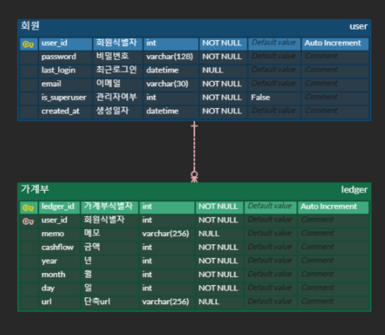

## :book: 가계부

> 환경설정

> ERD

- 가계부 년/월/일 필터링 할 일이 있을 것 같아서 따로 column 만들었는데 맞는건지 잘 모르겠다
- 메모도 charfield or textfield 잘 모르겠음

> HTTP 상태코드

> Object Copy
>
> [참고](https://docs.djangoproject.com/en/3.2/topics/db/queries/#copying-model-instances)